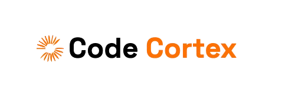

# CodeCortex

  

  

## Application Overview

**CodeCortex** is designed to be a comprehensive social and educational hub for developers. Built with Next.js and TypeScript, we’ve utilized **TailwindCSS** to ensure a cohesive and responsive user experience across all devices, providing consistent styling that adapts effortlessly to any screen size.

Users are encouraged to come ask their **coding-related questions** and engage in **discussions** with the community. Whether they are seeking help with coding problems, offering solutions, or participating in technical conversations, this platform fosters a collaborative environment for developers of all levels.

## Tech Stack

- **Frontend**: 
  - TypeScript
  - Next.js
  - TailwindCSS
- **Backend**:
  - Node.js
  - Express.js 
  - MongoDB
- **Authentication**: 
  - Clerk
- **API Integration**:
  - ChatGPT API (OpenAI)

### Core Features

1. **Reusable Components:**
   We implemented **reusable components** throughout the entire application to maintain consistency and reduce redundancy in our codebase. This approach ensures efficient development, maintainability, and scalability as the project evolves.

2. **Database Syncing:**
   We’re utilizing two databases: **MongoDB** and **Clerk**. These are synced through webhooks, ensuring that data is properly assigned to specific users throughout the application. This guarantees that user interactions are recorded accurately, and profile data is always up to date.

3. **Global & Filtered Search:**
   To enhance usability, we have implemented both **global search** and **filtered search** functionalities. By leveraging the **debounce function**, searches are optimized to improve performance and user experience, preventing excessive calls to the database while providing real-time feedback.

4. **Form Generation & Validation:**
   We are using **React Hook Form** to generate form components, which simplifies form handling and ensures efficient data management. Additionally, **Zod** is integrated for validation, ensuring that all form inputs meet the necessary criteria, enhancing user input reliability and data integrity.

5. **Complete Tagging System:**
   We have implemented a **tagging system** to categorize questions and topics. This allows users to easily assign tags to their questions and discussions, making it straightforward for others to search, filter, and discover relevant topics.

6. **User Stats Tracking:**
   A comprehensive **stats system** tracks all user interactions across the platform. This includes actions such as upvoting, answering questions, and other forms of engagement. These interactions are stored and analyzed to offer personalized user insights.

7. **Badging & Points System:**
   We’ve built a **badging and points system** to encourage active participation. Users can earn points and unlock badges as they engage with the platform, creating a gamified experience that motivates users to contribute and remain active on the site.

9. **AI Answering System:**
   The platform includes an **AI-driven answering system** that leverages **OpenAI’s API**. This feature helps users by providing automated, relevant responses to posted questions, boosting the efficiency of the platform and enhancing user experience.

10. **Responsive Design** 
   Fully responsive design with TailwindCSS, ensuring a smooth user experience across all devices.

## Future ToDo's 

*As of 25/09/2024: Most of the core functionality of the application is completed. Future updates would include implementing a job search feature for users of the site and adding some animations with FramerMotion*

## Deployment

The app is deployed on **Vercel**. You can access it [here](codecortex-kappa.vercel.app).

