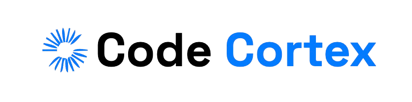

# CodeCortex

**CodeCortex** is a social and educational hub for developers. It serves as a platform for developers to connect, share knowledge, and learn from one another. CodeCortex incorporates a seamless user experience with advanced authentication, real-time interactions, and AI-driven content. 

## Current Feature in Development

*As of 16/09/2024: Currently working on implementing a voting/badge system across users of the site.*

## Tech Stack

- **Frontend**: 
  - TypeScript
  - Next.js
  - TailwindCSS
- **Backend**:
  - Node.js
  - Express.js 
  - MongoDB
- **Authentication**: 
  - Clerk
- **API Integration**:
  - ChatGPT API (OpenAI)
  - JSearch API

## Features

- **Developer Community**: A space for developers to connect, share projects, and engage in meaningful discussions.
- **User Authentication**: Secure and easy-to-use authentication powered by Clerk.
- **Responsive Design**: Fully responsive design with TailwindCSS, ensuring a smooth user experience across all devices.

### TODO

- **Jobs**: A dedicated section for developers to find job postings relevant to their skill sets, connect with employers, and explore career opportunities.
- **AI-Powered Assistance**: Implement AI-generated answers to coding questions using OpenAI's GPT models.

## Deployment

The app is deployed on **Vercel**. You can access it [here](codecortex-kappa.vercel.app).

